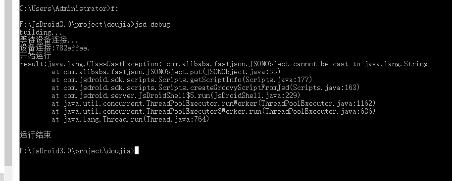

### 欢迎使用JsDroid3.0！
#### 介绍
JsDroid3去除了JsDroid2多余的功能，追求以最简单化的方式开发最需要的功能。
#### 下载
- 电脑下载

http://oss.beijing.jsdroid.com/jsdroid3/JsDroid3.0%E9%A2%84%E8%A7%88%E7%89%88.zip

- 手机下载

http://oss.beijing.jsdroid.com/jsdroid3/JsDroid3.0%E9%A2%84%E8%A7%88%E7%89%88.apk

- adb工具下载

http://oss.beijing.jsdroid.com/jsdroid3/adb.zip

#### 如何使用
1.电脑下载JsDroid3.zip

2.手机安装JsDroid3并启动

3.将JsDroid3.zip解压到D:/JsDroid3，并且将adb工具复制到D:/JsDroid3/bin

4.电脑添加环境变量path=D:/JsDroid3/bin

5.手机打开开发者模式，并且连接电脑

6.电脑打开命令行程序输入以下命令对demo项目编译：
```
D:
cd D:/JsDroid3/demo/demo01
jsd build
```

7.打开文件D:/JsDroid3/demo/demo01/src/MainScript.groovy

8.在MainScript.groovy中编写代码，如下：
```groovy
toast "我爱JsDroid3!"
```

9.输入命令调试
```
cd D:/JsDroid3/demo/demo01
jsd debug 
```
或者
```
jsd debug D:/JsDroid3/demo/demo01
```

10.打包apk
```
jsd pack D:/JsDroid3/demo/demo01
```
 
#### 创建项目
```
d:
mkdir d:/project
cd d:/project
jsd create helloworld

```
#### 编译项目
```
d:
cd d:/project/helloworld
jsd build
```
编译成功后得到文件：d:/project/helloworld/dist/helloworld.jsd

#### 调试
```
d:
cd d:/project/helloworld
jsd debug
```
或者
```
jsd debug d:/project/helloworld
```

#### 运行jsd文件
```
jsd run d:/project/helloworld/dist/helloworld.jsd
```
#### 打包apk
```
d:
cd d:/project/helloworld
jsd pack
```
打包成功后得到文件：d:/project/helloworld/dist/helloworld.apk


#### 项目结构

```
|-- 项目路径
  |-- src
    |-- MainScript.groovy 脚本入口
  |-- res
    |-- option.json 配置
    |-- readme.md 帮助
  |-- config.json 项目参数
  |-- icon.png 项目图标，建议1024x1024格式图片
```


#### 常用命令

- print 打印日志

```groovy
print "hello"
```

- toast 弹出消息

```groovy
toast "hello"
```

- click 点击坐标

```groovy
click 100,100
```

- swipe 滑动

```groovy
//从点(100,100)滑动到点(500,500)
swipe 100,100,500,500
//从点(100,100)滑动到点(500,500),补间20,每补间耗时5毫秒
swipe 100,100,500,500,20

```

- sleep 休眠

```groovy
//休眠1秒
sleep 1000
```

- time 时间戳

```groovy
t = time()
print t
```

- findNode 查找单个节点

```groovy
//正则查找界面上的节点，注意下面的符号"~"，它不是打错的字符，而是将"JsDroid.*"字符串编程正则表达式
def node = findNode ~"JsDroid.*"
if(node){
    print node.text    
}

```

- findNodeAll 查找多个节点

```groovy
//正则查找界面上的所有文字类型节点，注意下面的符号"~"，它不是打错的字符，而是将".*Text.*"字符串编程正则表达式
def nodes = findNodeAll ~".*TextView.*"
if(nodes){
    for(node in nodes){
        if(node.text){
            print node.text
        }    
    }

}
```

- inputText 输入文字

```groovy
//在输入框输入文字"JsDroid"，注意要先点击输入框
inputText "JsDroid"
```

- clearText 清除文字

```groovy
//清除光标前后各1000文字
clearText 1000,1000
```

- findPic 找图

```groovy
//参数分别为：图片路径(放到res文件夹里面)、左、上、右、下、色差、相似度
def ret = findPic "find.png",0,0,0,0,0x050505,0.9f
if(ret){
    click ret.x,ret.y
}
```

- findImg 多分辨率找图

```groovy
//参数分别为：图片路径(放到res文件夹里面)、左、上、右、下、色差、相似度
def ret = findImg "find.png",0,0,0,0,0x050505,0.9f
if(ret){
    click ret.left,ret.top
}
```

- readConfig 读取配置参数

```groovy
def value = readConfig("key","默认值")
print value
```

  
#### 目前发现的问题
1.部分手机调试代码会出现下图异常


#### 许可
个人随意，商业授权找who，很便宜，可定制。

